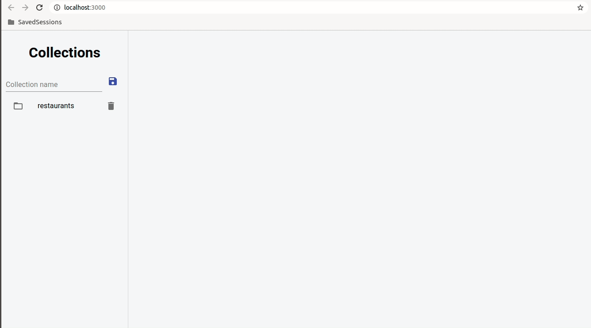

# Firestore Query Studio

A simple yet powerful application to query Firestore data.

## Functionality

- Read collections and documents
- Filter collections on multiple fields!
- Easy to setup

## Setup

- Clone this repo
- Get Firebase config file from Firebase Admin Panel : `Project Settings > General > Web App > Firebase SDK snippet > Config`
- Paste its content in `config.ts`, just make sure that there is a `export default firebaseConfig;` at the end of the file, like it is in the [example file](./src/config.example.ts).
- yarn install
- yarn start

## Current Limitations

- Subcollections are not supported
- It is not possible to edit/add/remove data
- Since Firestore client libraries do not allow to list existing collections, collection names must be added manually (this is saved in local storage for convenience :smile: )
- Config file can only be retrieved if there is a web project configured in Firebase

> This project was bootstrapped with [Create React App](https://github.com/facebook/create-react-app).
